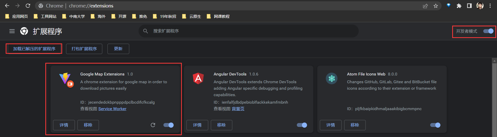

# gmap-plugin

> This is a chrome plugin for google map.

下面来介绍一下如何在 Chrome 中安装该插件：

首先将项目 clone 到本地:

```bash
git clone https://github.com/KK-wang/gmap-plugin.git
```

之后打开 Chrome，输入 URL `chrome://extensions/`。

然后点击右上角的**开发者模式**。

之后点击左上角出现的**加载已解压的扩展程序**，选中该项目的根目录（gmap-plugin） 。

出现下图则代表插件部署成功：



实际使用效果如下，右上角的开关用于控制插件是否生效：

